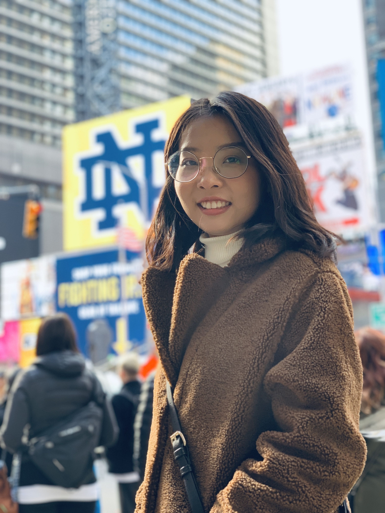

### Howdy!

My name is Sijia Yue. I am a second year master student in biostatistics at Columbia University Mailman School of Public Health. Prior to Columbia, I earned a bachelor of engineering degree in Beijing University of Posts and Telecommunications with a joint degree in Queen Mary University of London. Currently, I am a part time research assistant in Columbia University.

I am interested in data science and machine learning models, especially in healthcare industry and clinical settings. During my free time, I enjoy playing guitar, travelling and reading fancy posts on Medium.

[Resume](resume.html) | [LinkedIn](https://www.linkedin.com/in/sijia-yue-4100b7158/) | [Github](https://github.com/ysjbluemoon)

